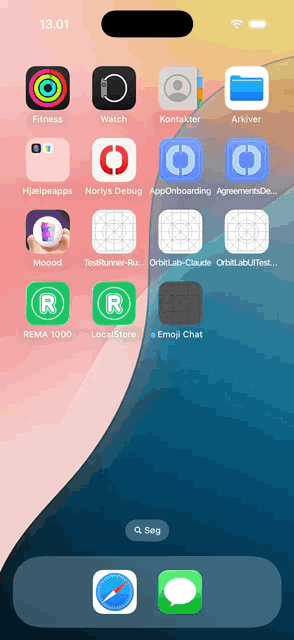

# ai-emoji-model

A 1.6M-parameter transformer that reads a Danish or English chat message and
answers with 1–5 emoji. Small enough to run on a low-end phone — small enough,
it turns out, to run in a browser tab with no ML runtime at all.

**[Try it](https://csshape.github.io/ai-emoji-model/report/test.html)** — three model
versions run locally in the page, ~6.5 MB of weights each.

The same model also runs inside native iOS and Android apps, on the phone, in
a few milliseconds per keystroke:

<p align="center">
  
</p>

## What it is

Multi-label classification over a fixed 512-emoji vocabulary, not generation.
Training labels come from people: mine messages where the author used emoji,
strip the emoji out, and use them as the target.

```
                     d_model 128 · 4 heads · 4 layers · d_ff 256 · max_len 64
text ──► SentencePiece (8k, shared da/en) ──► embed + pos
     ──► 4 × pre-norm encoder block ──► masked mean pool
     ──► linear ──► 512 sigmoids ──► prior correction ──► top 1–5
```

The encoder is written with plain ops rather than `nn.TransformerEncoder`, so
the graph exports cleanly to ONNX and Core ML.

## What we learned

The interesting part of this project is not the architecture. It is that the
labels people write are not the labels you would expect.

**Emoji is punctuation, not description.** Across 50,000 Danish chat messages,
89% of emoji sit at the very end and 76% of emoji-bearing messages contain no
`.` `!` or `?` at all. The emoji *is* the full stop.

**So the model learns to punctuate.** Ask the first version `jeg er sur`
("I am angry") and it answers 😂 — because among 1,895 Danish messages
containing "sur", 😂 is the single most common label. It is not being funny;
it is ending the sentence.

**The same concept is labelled differently per language.** Danish messages
about cycling (328 of them) are labelled 😂×52 😅×40 😊×17 — not one 🚲.
English messages about cycling (237) are labelled 🚲×54 as the top choice.
Danes punctuate; English speakers describe.

**Three failure modes that look identical from outside:**

| Symptom | Real cause | Fix |
|---|---|---|
| `Jeg cykler en tur` → 😳 | 🚲 not in the vocabulary at all | rebuild the label space |
| Danish object words → 😂 | texts exist, labels are generic | relabel with an LLM |
| `beer` → 👇 | 700 texts, 🍻 is the top label, model ranks it 127th of 512 | a training problem, still open |

**Measure against a constant.** A "model" that always answers 😂😅✨😊❤
scores recall@5 0.222 on the diagnostic set. The real model scores 0.274. On
two categories it scores *below* the constant.

**Synthetic training data teaches you to agree with the generator.** Adding
689 LLM-written training examples moved the LLM-built test set from 0.274 to
0.421 (+54%) and moved real human-labelled text by −0.007, with every
confidence interval crossing zero. Measuring on one test set would have
reported a breakthrough.

**Invented sentences help only where real ones are missing.** 124 of the 512
emoji have fewer than 50 Danish examples. Writing 100 sentences for each of
them took recall@5 on those emoji from 0.042 to 0.066–0.075 on real messages.
Writing 100 for every emoji made the common ones worse, and an emoji with one
real example learned whatever words the generator liked: 🟩 got 43 sentences
about "grøn", so *Grønland* started answering 🟩.

## Layout

```
emoji_model/         training, evaluation, export
  build_data.py      mine messages that carry emoji
  build_vocab.py     choose the 512 emoji, blending human and LLM votes
  prepare.py         tokenizer + tensors  (--boost adds train-only examples)
  train.py           BCE, AdamW, cosine schedule  (--class-balance for rare labels)
  infer.py           CLI: reply to text with emoji
  eval_short.py      held-out short messages, banded by length
  eval_phase.py      diagnostic set, broken down by category
  relabel.py         rewrite labels with a local LLM via LM Studio
  generate.py        write training sentences per emoji (LM Studio or Codex)
  keywords.py        word -> emoji dictionary from CLDR, plus country -> flag
  export_web.py      flatten a checkpoint into files a browser can run
report/
  test.html          side-by-side test bench, runs in the browser
  model/emoji.js     the forward pass in plain JavaScript
  model/check.mjs    verifies the JS against PyTorch
app/
  ios/               SwiftUI demo + Swift package EmojiModel
  android/           Compose demo + Kotlin module :emojimodel
  fixtures/          the browser's answers both ports are tested against
  sync_model.sh      copy a model from report/model into both apps
prompts/             prompts and a validator for generating test data
data/                vocabularies and the synthetic sets only (see below)
```

## Running it

```bash
uv sync
uv run python -m emoji_model.build_data          # mine a corpus (see note)
uv run python -m emoji_model.prepare --mined data/mined.jsonl --outdir data
uv run python -m emoji_model.train --data data --out checkpoints
uv run python -m emoji_model.infer "jeg er sur"
```

The browser bench needs an http server, not `file://`:

```bash
uv run python -m emoji_model.export_web --model base:checkpoints/best.pt:data
cd report && python3 -m http.server 8000     # → http://127.0.0.1:8000/test.html
```

`report/model/check.mjs` compares the JavaScript implementation against PyTorch;
it currently matches on tokens, argmax and output emoji, within 2e-4 on
probabilities.

## On the phone

The apps are a chat with a friend: the model suggests emoji as you type, and
tapping a message you received proposes a reaction. Neither uses Core ML,
TFLite or any other runtime. 1.6M parameters need a few loops, and a hand port
can be held to the browser's exact answers: `app/fixtures/parity.json` has the
browser's tokens, emoji and top probability for 41 phrases, and both ports
match every one, within 5e-7 on probabilities.

```bash
# iOS (Xcode 26, iOS 17+)
cd app/ios/EmojiModel && swift test                 # parity + speed
open app/ios/EmojiChat.xcodeproj                    # run on a simulator

# Android (Android Studio's JDK, SDK 37)
cd app/android && ./gradlew :emojimodel:test         # parity + speed
./gradlew :app:installDebug                          # with an emulator running

# ship another model to both apps and refresh the fixture
app/sync_model.sh v11
```

Getting the ports to agree was mostly about text, not maths: Swift and Java
regexes match a code point where JavaScript's `.` matches a UTF-16 unit, their
`\s` means different things, and Swift compares canonically equivalent strings
as equal. Each port does it JavaScript's way and says so in a comment. The iOS
app starts with `-demoScript YES` to play the conversation in the recording
above.

## About the data

**The mined corpus is not in this repository, on purpose.** It is scraped from
Twitter and Reddit: X's terms permit redistributing tweet IDs but not tweet
text, Reddit content belongs to the people who wrote it, and these are real
people's messages. `build_data.py` rebuilds it.

What *is* here is the material we generated ourselves — the LLM-written
diagnostic and training sets under `data/testdata_codex/` and
`data/traindata_codex/`, and the 50,592 per-emoji sentences in
`data/synthetic_da.jsonl` — plus the emoji vocabularies and the exported weights.

## Status

Honest summary: the model does sentiment well and content better than it
did. All 102,726 Danish messages labelled only with generic smileys have been
relabelled, which took concrete-emoji recall@5 on real Danish messages from
0.076 to 0.124; synthetic sentences for rare emoji add a little more (0.131 at
best). Training is not seeded yet, so differences of about 0.01 between runs
are within noise.

Open threads: English has had none of this work and no content test set of its
own; first names pull answers off topic ("Christian skal have frokost" → 👤);
and some everyday words have no reliable signal in the data at all
("fredagsbar", "vi ses"), which a small hand-written phrase table would fix
more cheaply than more training.

MIT licensed.
